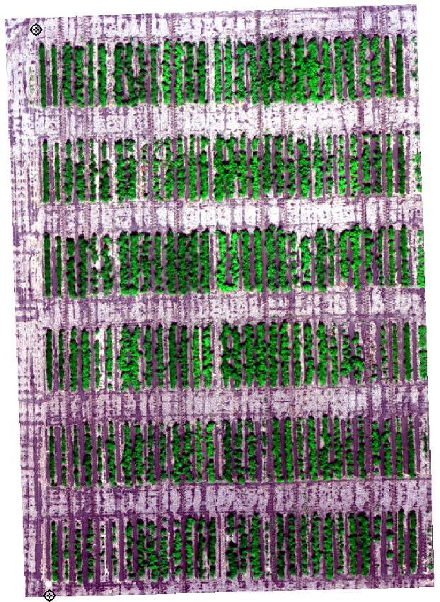

# Draw field trial plots using R scripts in QGIS

## Installation

In order to use these tools, you will need to first download and install the following software:
1. [QGIS](https://qgis.org/en/site/forusers/download.html)
2. [R](https://www.r-project.org/)

Once they are installed, you can open QGIS and install the **Processing R Provider** plugin by going to:

> Plugins > Manage and Install Plugins... > All > Search for "Processing R Provider" > Install Plugin

Then, download this repository by clicking on the green *Code* button:

> Code > Download ZIP

Unzip the downloaded folder and move it to a permanent location (any place from where it will not be moved or deleted).

Finally, go back to QGIS to adjust the following settings:

1. Find the Processing Toolbox pane, usually located on the right side of the screen. If you do not see it, go to:

> View > Panels > Processing Toolbox

and make sure it is enabled.

2. On the Processing Toolbox pane, click on the *Options* button, identified by a wrench icon. Then, go to:

> Providers > R

a) Double click on the editable field to the right side of *R scripts folder*, and then click on the [...] button that shows up at the end of this field. Click on the *Add* button on the new window that pops up and look for the **rscripts** folder inside the unzipped folder that you downloaded and placed in a permanent location. This will make sure that QGIS can find the R scripts and make them available in the Processing Toolbox.

b) Check the box for *Use 64 bit version*.

c) Check the box for *Use user library folder instead of system libraries*.

d) Double click on the editable field to the right side of *User library folder*, and then click on the [...] button that shows up at the end of this field. Here, there are two options based on your experience with R:

   * Option 1: If you have previously used R in your computer and have installed some R packages, you can look for your existing user library here. On Windows, the default location for the R library is "C:\Users\\**Your.Username**\Documents\R\win-library\\**Your-R-Version (4.0 or so)**".
   * Option 2: If you have never used R before and this is the first time you have installed it on your computer, or you are not able to locate your existing user library, look for the **library** folder inside the unzipped folder that you downloaded and placed in a permanent location.

After doing this, you should be able to find the new tools in the Processing Toolbox pane under:

> R > Draw trial plots

## Usage

This package contains four different tools. The parameters are the same for all of them, but each tool uses a different type of input for the location of the trial(s). "Draw plots from clicks" can draw plots from one trial at a time. The other three tools can be used to draw plots for multiple trials at the same time. However, only "Draw plots from Excel file" allows the user to specify different parameters for each trial. "Draw plots from points" and "Draw plots from polygons" will use the same parameters for every trial regarding plot labels and dimensions. Each tool is accompanied by a help text that should be displayed on the right side of the tool interface when it is opened.

This section will demonstrate the usage of this package using "Draw plots from clicks". The data used in these examples can be found in the **sampledata** folder located inside the unzipped folder that you downloaded and placed in a permanent location. The location of the bottom left and top left corners of the trial are shown in the figure below.

a) 3 blocks, 2 ranges per block, 15 plots per range (each plot contains 2 rows of plants), IDs in serpentine starting at the bottom left corner.

b) 1 block (i.e., not block design), 6 ranges, 15 plots per range (each plot contains 2 rows of plants), sequential IDs starting at the top left corner.

c) 2 blocks, 3 ranges per block, 30 plots per range (each plot contains 1 row of plants), sequential IDs starting at the top right corner, no borders.

d) 1 block (i.e., not block design), 6 ranges, 10 plots per range (each plot contains 3 rows of plants), IDs in serpentine starting at the bottom right corner, user-specified starting ID.

