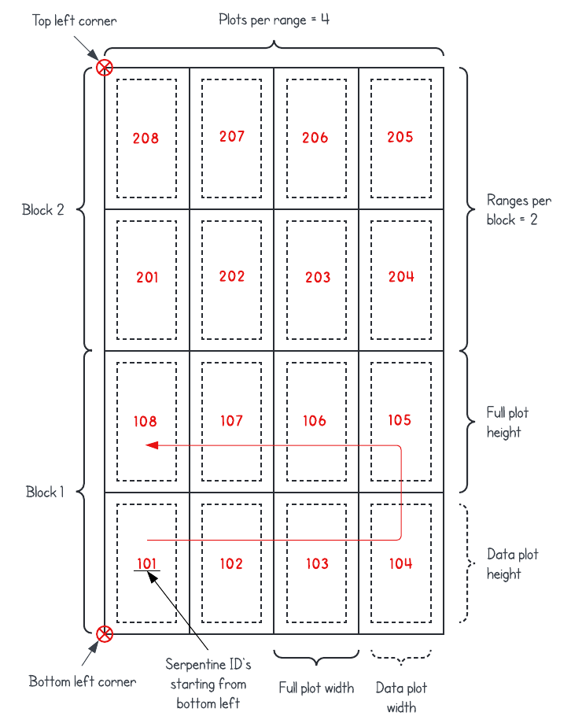

# Draw and label trial plots in QGIS

This plot drawing tool for QGIS aims to provide a simple solution to create ploygons that represent your plots over satellite or aerial imagery. The beauty of this tool is in its automatic labeling capabilities, which in most cases allows you to replicate your labels in the field by adjusting a few parameters.

## Updates

As of July 1st, 2024, only the "Draw plots from clicks" tool has been updated and is available under the new name "Plot drawing tool". The other tools ("Draw plots from points", "Draw plots from polygons", and "Draw plots from Excel") are broken and have been deprecated due to low usage. If you used one of these tools and would like to keep using it, please feel free to raise an issue requesting it to be updated.

## Installation

You will need QGIS and R installed on your machine to use this tool. Please follow the links below to download and install the latest versions available for your OS:
1. [QGIS](https://qgis.org/en/site/forusers/download.html)
2. [R](https://www.r-project.org/)

Once QGIS and R are installed, you can open QGIS and install the **Processing R Provider** plugin by going to:

> Plugins > Manage and Install Plugins... > All > Search for "Processing R Provider" > Install Plugin

Then, download this repository by clicking on the green *Code* button:

> Code > Download ZIP

Unzip the downloaded folder and move it to a permanent location (any place from where it will not be moved or deleted).

Finally, go back to QGIS to adjust the following settings (this tutorial was created on Windows, other systems might have different settings):

1. Find the Processing Toolbox pane, usually located on the right side of the screen. If you do not see it, go to:

> View > Panels > Processing Toolbox

and make sure it is enabled.

2. On the Processing Toolbox pane, click on the *Options* button, identified by a wrench icon. Then, go to:

> Providers > R

a) Double click on the editable field to the right side of *R scripts folder*, and then click on the [...] button that shows up at the end of this field. Click on the *Add* button on the new window that pops up and look for the **rscripts** folder inside the unzipped folder that you downloaded and placed in a permanent location. This will make sure that QGIS can find the R scripts and make them available in the Processing Toolbox.

b) Check the box for *Use 64 bit version*.

c) Check the box for *Use user library folder instead of system libraries*.

d) If there is a path already defined for *User library folder*, you can leave it as is. Otherwise, double click on the editable field to the right side of *User library folder*, and then click on the [...] button that shows up at the end of this field. Here, there are two options based on your experience with R:

   * Option 1: If you have previously used R in your computer and have installed some R packages, you can look for your existing user library here. On Windows, the default location for the R library is "C:\Users\\**Your.Username**\Documents\R\win-library\\**Your-R-Version**".
   * Option 2: If you have never used R before and this is the first time you have installed it on your computer, or you are not able to locate your existing user library, look for the **library** folder inside the unzipped folder that you downloaded and placed in a permanent location.

After doing this, you should be able to find the new tools in the Processing Toolbox pane under:

> R > Draw trial plots

## Usage

This section will demonstrate the usage of the "Plot drawing tool". The tool is accompanied by instructions that should be displayed on the right side of the user interface window when it is opened in QGIS. The data used in these examples can be found in the **sampledata** folder located inside the unzipped folder that you downloaded and placed in a permanent location. The location of the bottom left and top left corners of the trial are shown in the figure below.

a) 3 blocks, 2 ranges per block, 15 plots per range (each plot contains 2 rows of plants), IDs in serpentine starting at the bottom left corner.

b) 1 block (i.e., not block design), 6 ranges, 15 plots per range (each plot contains 2 rows of plants), sequential IDs starting at the top left corner.

c) 2 blocks, 3 ranges per block, 30 plots per range (each plot contains 1 row of plants), sequential IDs starting at the top right corner, no borders.

d) 1 block (i.e., not block design), 6 ranges, 10 plots per range (each plot contains 3 rows of plants), IDs in serpentine starting at the bottom right corner, user-specified starting ID.

