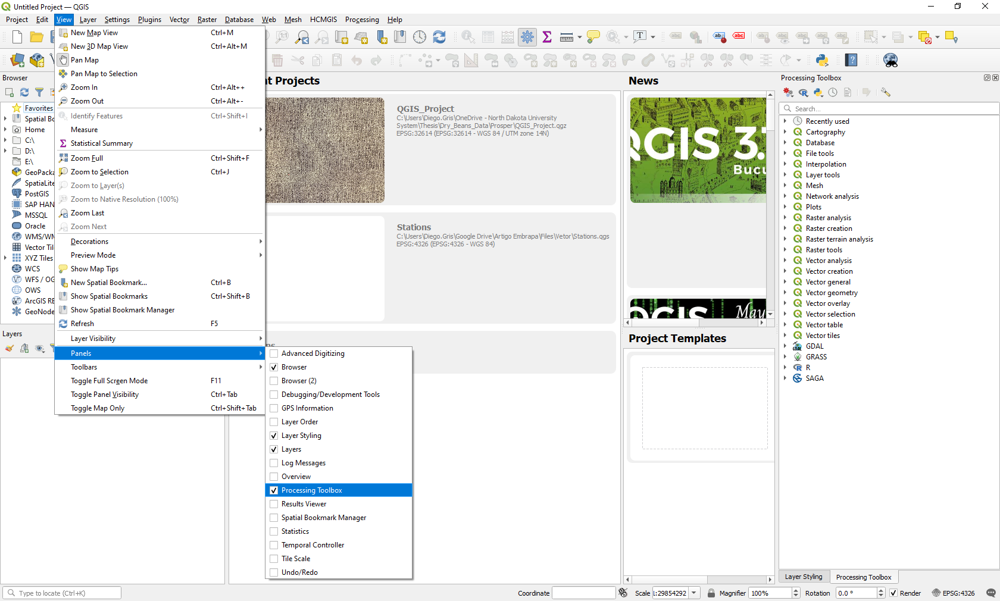

# Draw field experiment plots using R scripts in QGIS

## Installation

In order to use these tools, you will need to first download and install the following software:
1. [QGIS](https://qgis.org/en/site/forusers/download.html)
2. [R](https://www.r-project.org/)

Once they are installed, you can open QGIS and install the **Processing R Provider** plugin by going to:

> Plugins > Manage and Install Plugins... > All > Search for "Processing R Provider" > Install Plugin

Then, download this repository by clicking on the green *Code* button:

> Code > Download ZIP

Unzip the downloaded folder and move it to a permanent location (any place from where it will not be moved or deleted).

Finally, go back to QGIS to adjust the following settings:

1. Find the Processing Toolbox pane, usually located on the right side of the screen. If you do not see it, go to:

> View > Panels > Processing Toolbox

and make sure it is enabled.

2. On the Processing Toolbox pane, click on the *Options* button, identified by a wrench icon. Then, go to:

> Providers > R

a) Double click on the editable field to the right side of *R scripts folder*, and then click on the [...] button that shows up at the end of this field. Click on the *Add* button on the new window that pops up and look for the **rscripts** folder inside the unzipped folder that you downloaded and placed in a permanent location. This will make sure that QGIS can find the R scripts and make them available in the Processing Toolbox.

b) Check the box for *Use 64 bit version*.

c) Check the box for *Use user library folder instead of system libraries*.

d) Double click on the editable field to the right side of *User library folder*, and then click on the [...] button that shows up at the end of this field. Here, there are two options based on your experience with R:

   * Option 1: If you have previously used R in your computer and have installed some R packages, you can look for your existing user library here. On Windows, the default location for the R library is "C:\Users\\**Your.Username**\Documents\R\win-library\\**Your-R-Version (4.0 or so)**".
   * Option 2: If you have never used R before and this is the first time you have installed it on your computer, or you are not able to locate your existing user library, look for the **library** folder inside the unzipped folder that you downloaded and placed in a permanent location.

After doing this, you should be able to find the new tools in the Processing Toolbox pane under:

> R > Draw trial plots

